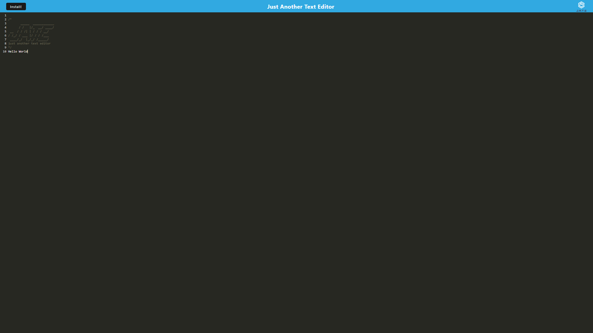

# README Generator

## Table of Contents

1. [Description](#description)
2. [Installation](#installation)
3. [Usage](#usage)
4. [Contributing](#contributing)
5. [License](#license)
6. [Questions](#questions)
7. [Screenshot](#Screenshot)

## Description

Just Another Text Editor (J.A.T.E) is a Progressive Web Application (PWA) that allows users to create and edit notes or code snippets with or without an internet connection. This app features offline functionality, data persistence with IndexedDB, and is built using modern web technologies such as Webpack, Babel, and Workbox. It can be installed on desktops and provides a seamless user experience for note-taking and code editing.

## Installation

- git clone https://github.com/your-username/your-repository.git
  cd your-repository
- npm i
- create a .env file in the root directory and add the necessary environment variables. (PORT = 3001)
- npm start

## Usage

Check it out [here](link)!

## Contributing

Contribution Guidelines

- Code of Conduct: Please adhere to our Code of Conduct in all your interactions with the project.
- Testing: Ensure that your changes do not break any existing functionality and include tests if applicable.
- Documentation: Update the documentation (including the README file) as necessary to reflect your changes.
  Thank you for contributing!

## License

This project is licensed under the MIT License. See the [MIT License](https://opensource.org/licenses/MIT) for details.

## Questions

For any questions, please contact me at [wolfleithold@gmail.com](mailto:wolfleithold@gmail.com).
You can also find me on GitHub: [wolfleithold](https://github.com/wolfleithold).

## Screenshot

